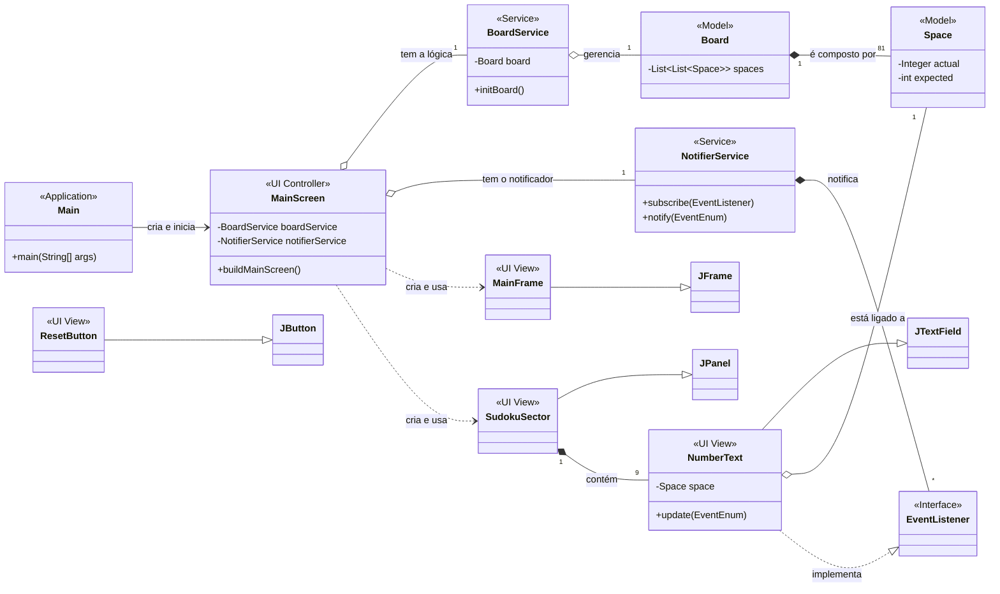

# Sudoku


Um projeto que implementa um jogo de Sudoku funcional, desenvolvido em Java com a biblioteca Swing para a interface gráfica. O foco foi a aplicação de boas práticas de Orientação a Objetos, componentização da UI e programação orientada a eventos.

---

## 📖 Sobre o Projeto

O Jogo de **Sudoku** foi criado como um projeto prático para a construção de uma aplicação desktop completa, desde a lógica de negócio até a interface com o usuário. O desenvolvimento foi guiado pela separação de responsabilidades, utilizando uma arquitetura que isola o modelo de dados (as regras e o estado do tabuleiro) da visualização (a janela e os componentes gráficos).

O projeto se destaca pela sua estrutura componentizada, onde cada elemento da interface é uma classe customizada, e pelo uso do padrão de projeto Observer para a comunicação entre os componentes, resultando em um código de baixo acoplamento e de fácil manutenção.

---

## ✨ Funcionalidades
✅ Interface Gráfica Completa: Tabuleiro 9x9 construído com Swing, com separação visual clara dos setores 3x3.

✅ Carregamento Dinâmico: O tabuleiro inicial é carregado a partir de uma configuração de texto, permitindo diferentes desafios.

✅ Validação de Entrada: Apenas números de um único dígito (1-9) podem ser inseridos nos campos.

✅ Células Fixas: Números que fazem parte do desafio inicial são bloqueados para edição.

✅ Verificação de Status: Um botão permite ao jogador verificar a qualquer momento se o tabuleiro está completo ou se contém erros.

✅ Reiniciar Jogo: Opção para limpar todo o progresso feito pelo jogador, mantendo os números iniciais.

✅ Condição de Vitória: O jogo pode ser finalizado, informando o jogador sobre o sucesso ou sobre inconsistências restantes.

---

## 🏛️ Diagrama UML do Sistema

O diagrama abaixo ilustra a arquitetura do projeto, mostrando como as classes do modelo, serviço e interface se relacionam.

<details>
<summary><strong>Clique para expandir o Diagrama de Classes (UML)</strong></summary>


    </details>


## 🛠️ Tecnologias Utilizadas

* **[Java](https://www.java.com/)**: Linguagem principal do projeto.
* **[Swing](https://docs.oracle.com/javase/tutorial/uiswing/)**: Biblioteca nativa do Java para a criação da interface gráfica (GUI).
* **[Mermaid](https://mermaid.js.org/)**: Ferramenta para a criação do diagrama UML.


## 🚀 Como Executar o Projeto

Para executar este projeto localmente, siga os passos abaixo.

### Pré-requisitos

* É necessário ter o **JDK (Java Development Kit)**, versão 17 ou superior, instalado em sua máquina.
* Um editor de código ou IDE de sua preferência (Ex: VS Code, IntelliJ IDEA, Eclipse).

### Instalação e Execução

1.  Clone o repositório:
    ```sh
    git clone [https://github.com/Carlos-Manoel-2005/Sodoku](https://github.com/Carlos-Manoel-2005/Sodoku)
    ```
2.  Navegue até o diretório do projeto:
    ```sh
    cd Sodoku
    ```
3.  Compile os arquivos `.java`. Supondo que seus arquivos estejam na pasta `src`, o seguinte comando irá compilar e colocar os `.class` na pasta `bin`:
    ```sh
    javac -d bin -sourcepath src src/application/Main.java
    ```
4.  Execute a aplicação, passando a **String** de configuração do tabuleiro como argumento
    ```sh
    java -cp bin application.Main "0,0;4,false 1,0;7,false 2,0;9,true 3,0;5,false 4,0;8,true 5,0;6,true 6,0;2,true 7,0;3,false 8,0;1,false 0,1;1,false 1,1;3,true 2,1;5,false 3,1;4,false 4,1;7,true 5,1;2,false 6,1;8,false 7,1;9,true 8,1;6,true 0,2;2,false 1,2;6,true 2,2;8,false 3,2;9,false 4,2;1,true 5,2;3,false 6,2;7,false 7,2;4,false 8,2;5,true 0,3;5,true 1,3;1,false 2,3;3,true 3,3;7,false 4,3;6,false 5,3;4,false 6,3;9,false 7,3;8,true 8,3;2,false 0,4;8,false 1,4;9,true 2,4;7,false 3,4;1,true 4,4;2,true 5,4;5,true 6,4;3,false 7,4;6,true 8,4;4,false 0,5;6,false 1,5;4,true 2,5;2,false 3,5;3,false 4,5;9,false 5,5;8,false 6,5;1,true 7,5;5,false 8,5;7,true 0,6;7,true 1,6;5,false 2,6;4,false 3,6;2,false 4,6;3,true 5,6;9,false 6,6;6,false 7,6;1,true 8,6;8,false 0,7;9,true 1,7;8,true 2,7;1,false 3,7;6,false 4,7;4,true 5,7;7,false 6,7;5,false 7,7;2,true 8,7;3,false 0,8;3,false 1,8;2,false 2,8;6,true 3,8;8,true 4,8;5,true 5,8;1,false 6,8;4,true 7,8;7,false 8,8;9,false"
    ```

## 🕹️ Como Usar

Ao iniciar o programa, a janela do jogo Sudoku será exibida:


> 1.  **Preencha os Espaços**: Digite os números que você acredita serem os corretos nos quadrados brancos. Os quadrados de cor diferente são fixos e não podem ser alterados.
> 2.  **Verificar Jogo**: A qualquer momento, clique neste botão para receber uma mensagem informando se o tabuleiro está completo e se contém erros.
> 3.  **Reiniciar Jogo**: Clicar neste botão pedirá uma confirmação. Se aceito, todos os números que você inseriu serão apagados.
> 4.  **Concluir**: Quando acreditar que terminou, clique neste botão para uma verificação final. O jogo informará se você venceu ou se ainda existem inconsistências.

## 📄 Licença

Este projeto está sob a licença MIT. Veja o arquivo LICENSE para mais detalhes.


